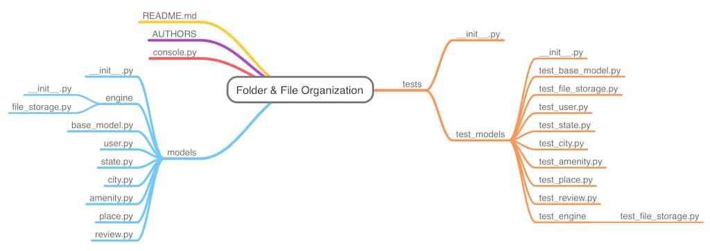
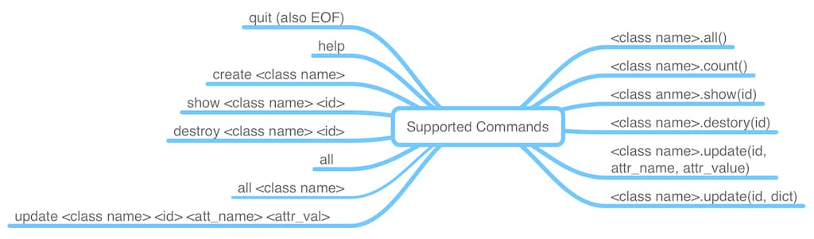

<a target="_blank" href="https://kalbetre-alx.github.io/AirBnB_clone/web_static">
<svg width="249" height="76" viewBox="0 0 249 76" xmlns="http://www.w3.org/2000/svg" xmlns:xlink="http://www.w3.org/1999/xlink"><g transform="translate(0 0)">
<rect width="227" height="36" rx="5" transform="translate(0 0)" fill="#3aadd0" stroke="#e0e0e0" stroke-width="1"></rect><text transform="translate(43 23)" fill="white" font-size="14" font-family="Roboto-Medium,Roboto" ><tspan x="0" y="0">Static Pages Live Demo</tspan></text>
</g><g transform="translate(12 6)"><rect width="24" height="24" fill="#ffffff" opacity="0"></rect><g transform="matrix(0.14 0 0 0.14 12 12)">
<path style="stroke: none; stroke-width: 1; stroke-dasharray: none; stroke-linecap: butt; stroke-dashoffset: 0; stroke-linejoin: miter; stroke-miterlimit: 4; fill: rgb(0,0,0); fill-rule: nonzero; opacity: 1;" transform=" translate(-64, -64)" d="M 14 1 C 6.8 1 1 6.8 1 14 L 1 24 L 1 28 C 1 29.7 2.3 31 4 31 L 124 31 C 125.7 31 127 29.7 127 28 L 127 14 C 127 6.8 121.2 1 114 1 L 14 1 z M 18 13 L 22 13 C 23.7 13 25 14.3 25 16 C 25 17.7 23.7 19 22 19 L 18 19 C 16.3 19 15 17.7 15 16 C 15 14.3 16.3 13 18 13 z M 34 13 L 38 13 C 39.7 13 41 14.3 41 16 C 41 17.7 39.7 19 38 19 L 34 19 C 32.3 19 31 17.7 31 16 C 31 14.3 32.3 13 34 13 z M 76 13 L 110 13 C 111.7 13 113 14.3 113 16 C 113 17.7 111.7 19 110 19 L 76 19 C 74.3 19 73 17.7 73 16 C 73 14.3 74.3 13 76 13 z M 4 37 C 2.3 37 1 38.3 1 40 L 1 114 C 1 121.2 6.8 127 14 127 L 114 127 C 121.2 127 127 121.2 127 114 L 127 40 C 127 38.3 125.7 37 124 37 L 4 37 z M 37 62.900391 C 38.4 62.900391 39.600391 63.799219 39.900391 65.199219 L 45 85.599609 L 50.099609 65.199219 C 50.499609 63.599219 52.099219 62.6 53.699219 63 C 55.299219 63.5 56.300391 65.099219 55.900391 66.699219 L 47.900391 98.699219 C 47.600391 99.999219 46.4 101 45 101 C 43.6 101 42.399609 100.09922 42.099609 98.699219 L 37 78.400391 L 31.900391 98.800781 C 31.600391 100.10078 30.4 101.09961 29 101.09961 C 27.6 101.09961 26.399609 100.20078 26.099609 98.800781 L 18.099609 66.800781 C 17.699609 65.200781 18.700781 63.599219 20.300781 63.199219 C 21.900781 62.799219 23.500391 63.800391 23.900391 65.400391 L 29 85.599609 L 34.099609 65.199219 C 34.399609 63.899219 35.6 62.900391 37 62.900391 z M 64 63 L 78 63 C 79.7 63 81 64.3 81 66 C 81 67.7 79.7 69 78 69 L 67 69 L 67 79 L 78 79 C 79.7 79 81 80.3 81 82 C 81 83.7 79.7 85 78 85 L 67 85 L 67 95 L 78 95 C 79.7 95 81 96.3 81 98 C 81 99.7 79.7 101 78 101 L 64 101 C 62.3 101 61 99.7 61 98 L 61 66 C 61 64.3 62.3 63 64 63 z M 89 63 L 96 63 C 101.5 63 106 67.5 106 73 C 106 75.1 105.29922 77.099219 104.19922 78.699219 C 107.69922 80.799219 110 84.6 110 89 C 110 95.6 104.6 101 98 101 L 89 101 C 87.3 101 86 99.7 86 98 L 86 66 C 86 64.3 87.3 63 89 63 z M 92 69 L 92 77 L 96 77 C 98.2 77 100 75.2 100 73 C 100 70.8 98.2 69 96 69 L 92 69 z M 92 83 L 92 95 L 98 95 C 101.3 95 104 92.3 104 89 C 104 85.7 101.3 83 98 83 L 92 83 z" stroke-linecap="round"></path>
</g></g></svg>
</a>

# AirBnB Clone - The Console

## Project Overview
AirBnB Clone (the console) is the first in the serious of projects to wards a full stack AirBnB web application. This repo contains a console application that can be used to manage the various instances of class used in the AirBnB web application.


## Project File Organization
This project is organized as shown in the diagram below. In this hierarchal structure, all the models are stored in the models folder while the tests are stored in the tests folder



## Supported Commands
This console application supports a number of commands. This commands can be run in both interactive and non-interactive modes.



## Usage

### Starting the interpreter
The console interpreter can be used in both interactive and non-interactive modes

#### Interactive Mode
```bash
$ ./console.py
(hbnb) help

Documented commands (type help <topic>):
========================================
EOF  all  count  create  destroy  help  quit  show  update

(hbnb) 
(hbnb) quit
$
```

#### Non-Interactive Mode
```bash
$ echo "help" | ./console.py
(hbnb) 
Documented commands (type help <topic>):
========================================
EOF  all  count  create  destroy  help  quit  show  update

(hbnb)
$
```

### Executing commands
To execute a command you specify it's name and optionally its arguments. Some commands have no arguments while others have multiple. The help command shows the details of all the commands.

#### Examples on Interactive Mode

```bash
$ ./console.py
(hbnb) create BaseModel
d81b20ec-5b06-42d3-aefe-ea3798892a19
(hbnb) all
["[BaseModel] (d81b20ec-5b06-42d3-aefe-ea3798892a19) {'id': 'd81b20ec-5b06-42d3-aefe-ea3798892a19', 'created_at': datetime.datetime(2022, 10, 30, 22, 39, 14, 426961), 'updated_at': datetime.datetime(2022, 10, 30, 22, 39, 14, 426981)}"]
(hbnb) show BaseModel d81b20ec-5b06-42d3-aefe-ea3798892a19
[BaseModel] (d81b20ec-5b06-42d3-aefe-ea3798892a19) {'id': 'd81b20ec-5b06-42d3-aefe-ea3798892a19', 'created_at': datetime.datetime(2022, 10, 30, 22, 39, 14, 426961), 'updated_at': datetime.datetime(2022, 10, 30, 22, 39, 14, 426981)}
(hbnb) quit
$
```

#### Examples on Non-Interactive Mode

```bash
❯ echo "create BaseModel" | ./console.py
(hbnb) 64b15c6c-6693-45fa-87c7-3ad1ae413b13
(hbnb)
$
$ echo "destroy BaseModel 64b15c6c-6693-45fa-87c7-3ad1ae413b13" | ./console.py
(hbnb)
$
```

## Authors
1. Kalkidan Betre
2. Kenny Ojimba
